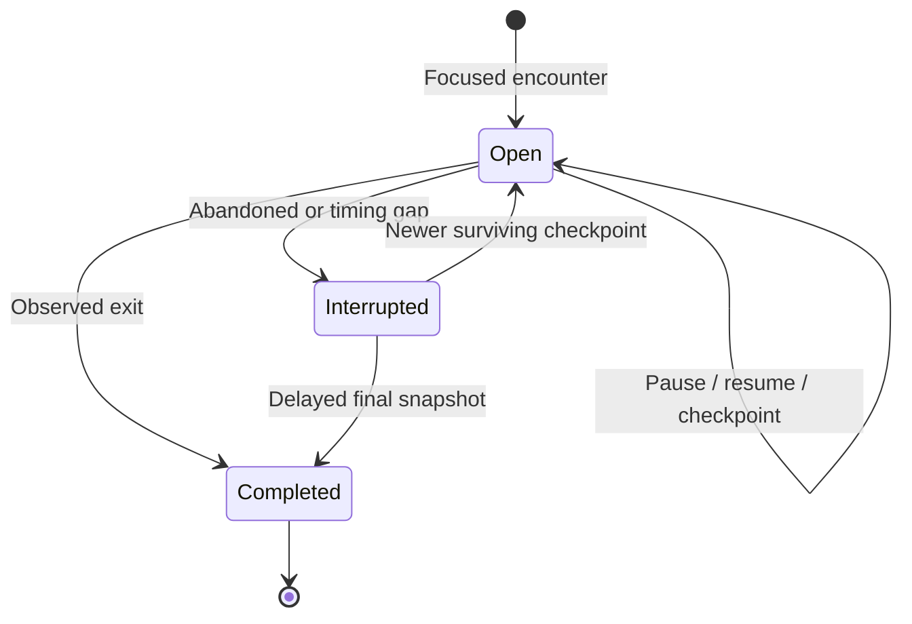
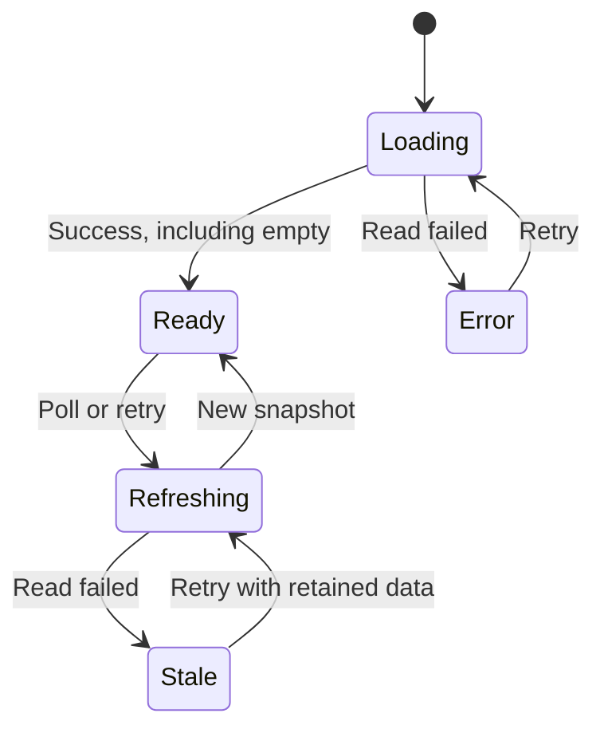

# Implementation design

- Behavior: [Requirements](spec.md).
- Data flow: [Architecture](../../docs/ARCHITECTURE.md).

## Modules

| Path | Responsibility |
| --- | --- |
| `src/config/dataMode.ts` | Env-selected source |
| `src/entrypoints/*.content.ts` | Platform entrypoints; dev guard |
| `src/utils/reelDetection.ts` | Route/video/viewport detection |
| `src/tracking/engine.ts` | Visits, clocks and active intervals |
| `src/tracking/outbox.ts` | Latest pending snapshot; retry |
| `src/tracking/background.ts` | Validated messages, focus and recovery |
| `src/tracking/storage.ts` | Transactions and additive upgrades |
| `src/tracking/query.ts` + `client.ts` | One read owner per range |
| `src/tracking/messages.ts` | Request transport and response validation |
| `src/types/` | Tracking, messages, query state, failures and themes |
| `src/utils/` | Database opening, errors, validation, selection and measurements |
| `src/theme/` | Palette and preference persistence |

## Storage

- Database: **doomgauge-v1**; preserve preferences and legacy stores.

| Store | Key | Contents |
| --- | --- | --- |
| visits | Visit ID | Collector/platform, timestamps, intervals, revision, status, optional reel/length; authenticated tab/document |
| trackingCoverage | Interval ID | Verified foreground span |
| trackingMeta | Dirty date | Summary invalidation |
| rollups | Date + platform | Count, completed skips, active ms |
| preferences | Name | Theme |

- Indexes: visits → end/status; coverage → end.
- Range queries: overlapping records.
- UI clipping: preserve visit identity.

## Visit lifecycle

- Recovery grace **10s**; startup and **1-minute** maintenance.
- Coverage joins verified heartbeats less than **5s** apart; gaps remain unknown.

## Messages

| Message | Sender → result |
| --- | --- |
| tracking:visit | Main-frame collector → commit acknowledgment |
| tracking:heartbeat | Collector → focus confirmation / bounded coverage |
| tracking:health | Collector → saving status |
| tracking:query | Extension page → visits/coverage/status for ≤100 days |
| tracking:probe / tracking:focus | Background → collector recovery/focus check |
| theme:get / theme:set | Extension page → preference read/save |
| theme:changed | Background → shared preference update |

## UI reads

- State acceptance criteria: [R11](spec.md#r11--modesloading).
