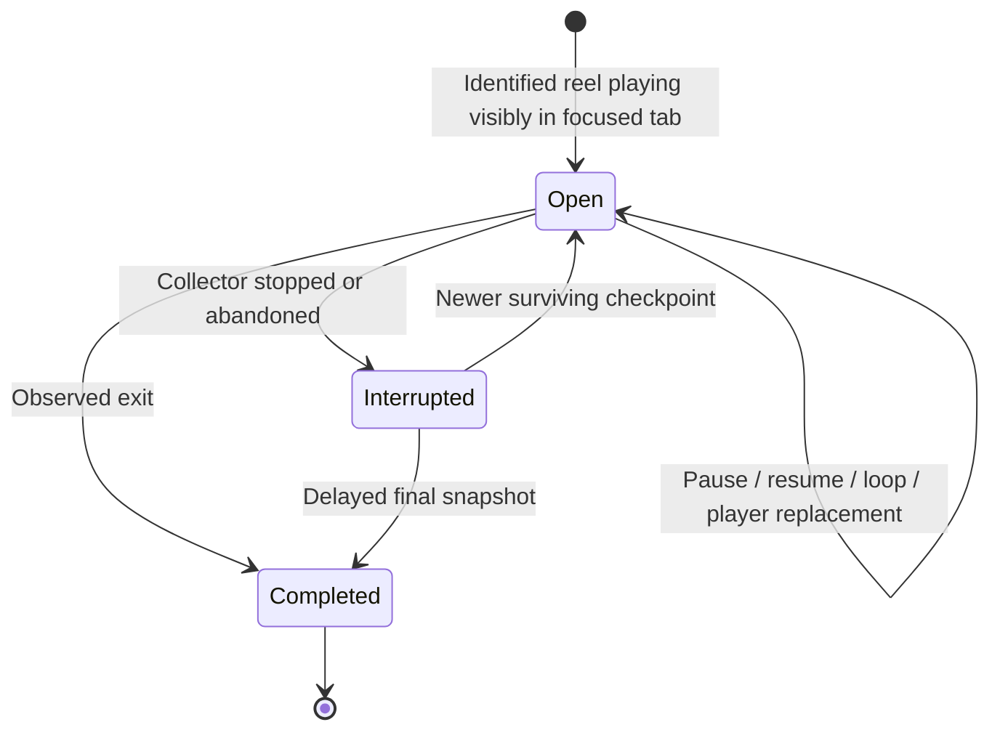
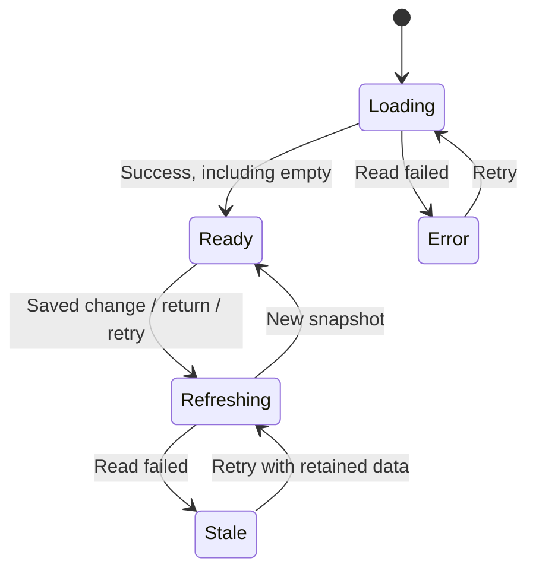

# Implementation design

- Behavior: [Requirements](spec.md).
- Data flow: [Architecture](../../docs/ARCHITECTURE.md).

## Modules

| Path | Responsibility |
| --- | --- |
| `src/config/dataMode.ts` | Env-selected source |
| `src/entrypoints/*.content.ts` | Platform entrypoints; dev guard |
| `src/tracking/detection.ts` | DOM video selection; pure route/viewport helpers in utils |
| `src/tracking/engine.ts` | Visits, clocks and active intervals |
| `src/tracking/outbox.ts` | Latest pending snapshot; retry |
| `src/tracking/background.ts` + `service.ts` | Message/event wiring; ingestion, focus and recovery |
| `src/storage/` | Shared database lifecycle; activity and preference repositories |
| `src/tracking/query.ts` + `client.ts` | One read owner per range |
| `src/tracking/messages.ts` | Request transport and response validation |
| `src/types/` | Tracking, messages, query state, failures and themes |
| `src/utils/` | Pure validation, selection and measurements |
| `src/runtime/` | Message transport and failure reporting |
| `src/theme/` | Theme controller, subscriptions and save/broadcast service |
| `src/components/tokens.ts` | Palette and semantic visual tokens |

## Storage

- Database: **doomgauge-v1**; preserve preferences and legacy stores.
- One shared lazy connection; version changes close/invalidate it. Failed opens can be retried.

| Store | Key | Contents |
| --- | --- | --- |
| visits | Visit ID | Collector/platform, timestamps, intervals, revision, status, optional reel/length; authenticated tab/document |
| trackingCoverage | Interval ID | Verified foreground span |
| trackingMeta | Dirty date / schema-version | Summary invalidation and completed migration version |
| rollups | Date + platform | Count, completed skips, active ms |
| preferences | Name | Theme |

- Indexes: visits → end/status/day; coverage → end/day. UTC day keys bound reads; long spans use one fallback key.
- Range queries: overlapping records.
- UI clipping: preserve visit identity.

| Schema | Migration, in the same database |
| --- | --- |
| 1 | Original stores and indexes; adopt unversioned legacy data |
| 2 | Day indexes; backfill keys on existing visits/coverage |

- Native IndexedDB version increments only to run an upgrade; schema-version records the numbered migration.
- Upgrade failure rolls back all changes; unsupported newer schema remains untouched.

## Visit lifecycle

```mermaid
stateDiagram-v2
  [*] --> Open: Identified reel playing visibly in focused tab
  Open --> Open: Pause / resume / loop / player replacement
  Open --> Completed: Observed exit
  Open --> Interrupted: Collector stopped or abandoned
  Interrupted --> Open: Newer surviving checkpoint
  Interrupted --> Completed: Delayed final snapshot
  Completed --> [*]
```

- Dedicated content routes only; one player with ≥50% viewport area. Center hits may land on the video or its bounded controls container. Reject conflicting YouTube renderer IDs.
- Controls: nearest shared ancestor of video/hit, exactly one video, edges within 2px of the video; exclude body, HTML, main and unrelated dialogs.
- No nearby-link or video-source identity fallback. Missing/covered players pause time; confirmed route exit ends the visit.
- Temporary tab switches and sampling gaps preserve the visit; unobserved time is never added.
- Recovery grace **10s**; startup and **1-minute** maintenance.
- Coverage joins verified heartbeats less than **5s** apart; gaps remain unknown.

## Messages

| Message | Sender → result |
| --- | --- |
| tracking:visit | Main-frame collector → commit acknowledgment |
| tracking:heartbeat | Collector → focus confirmation / bounded coverage |
| tracking:health | Collector → saving status |
| tracking:query | Extension page → visits/coverage/status for ≤100 days |
| tracking:probe / tracking:focus | Background → collector recovery/focus check |
| theme:get / theme:set | Extension page → preference read/save |
| theme:changed | Background → shared preference update |
| background:ready | Background → retry failed reads after receiver registration |
| tracking:changed | Background → invalidate overlapping visible ranges after commit |

## UI reads

```mermaid
stateDiagram-v2
  [*] --> Loading
  Loading --> Ready: Success, including empty
  Loading --> Error: Read failed
  Error --> Loading: Retry
  Ready --> Refreshing: Saved change / return / retry
  Refreshing --> Ready: New snapshot
  Refreshing --> Stale: Read failed
  Stale --> Refreshing: Retry with retained data
```

- State acceptance criteria: [R11](spec.md#r11--modesloading).
