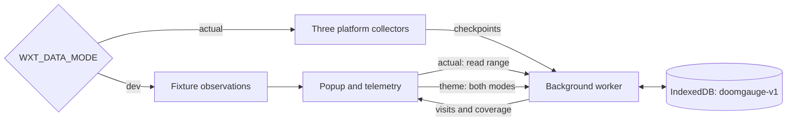
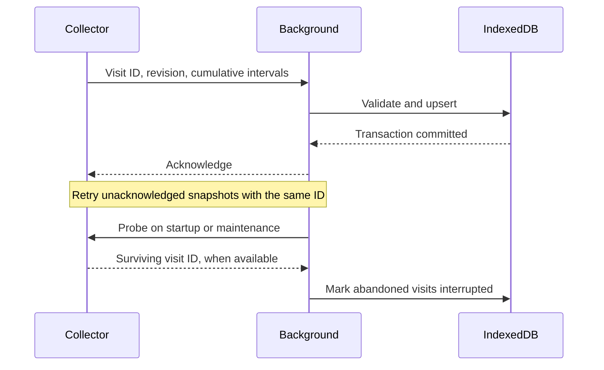

# Architecture

- Collectors: detect reels; measure focused playback.
- Background: sole database owner.
- Shared database opener; typed messages; failure causes stay in local diagnostics.
- UI: calculate charts from observations.
- Dev: fixtures only; no tracking or activity writes.

## Save and recover

- Save: start, state changes, ~2s checkpoints.
- Recovery: keep saved time; exclude downtime.
- Summaries: maintenance rebuilds; queries only read.
- Forced closure: unsaved tails can be lost.

[Contracts](../.spec/doom-gauge-v1/design.md) · [Acceptance criteria](../.spec/doom-gauge-v1/spec.md)
