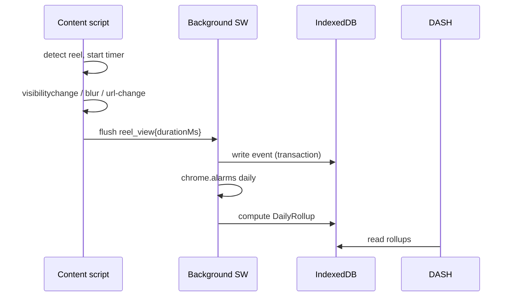
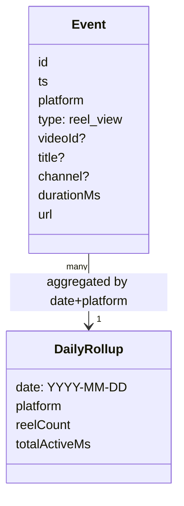

# Architecture

Few words. Diagrams first.

## System shape

```mermaid
flowchart LR
  YT[YouTube content script] --> BG[Background SW]
  IG[Instagram content script] --> BG
  FB[Facebook content script] --> BG
  BG --> DB[(IndexedDB<br/>events + rollups)]
  BG -->|chrome.alarms daily| ROLL[Aggregate rollups]
  DB --> DASH[Popup (glance)]
  DASH -->|open full| FULL[Full telemetry page (new-tab)]
  DASH -->|export| JSON[(Minified JSON)]
```

## Event lifecycle



## Storage model



## Key rules
- One shared IndexedDB per browser profile — safe across 3–4 windows.
- No backend in v1. Backend is a future, opt-in concern.
- Export = rollups only (tiny). Raw event-log export is out of scope for v1.
