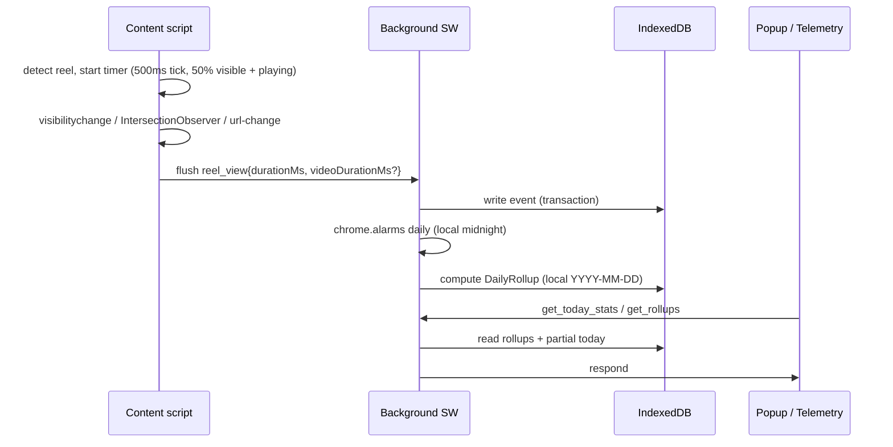
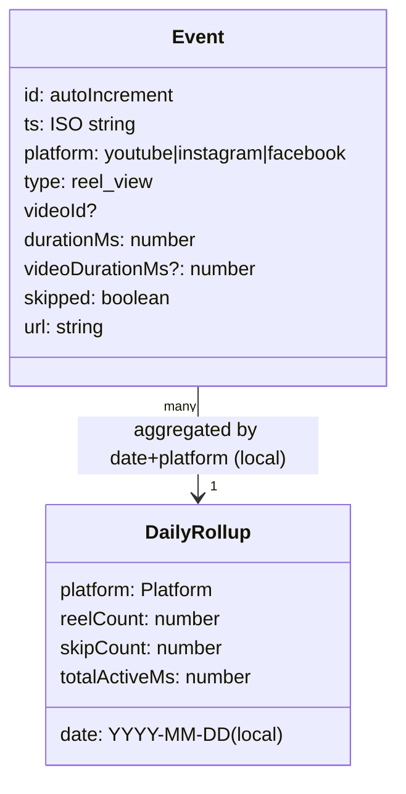

# Architecture

Popup mock refinement (September 2026): `src/data/popupMock.ts` supplies one internally consistent platform dataset, derived headline/hourly values and same-cutoff yesterday fixtures. This is UI-only; production message/storage architecture and Surface B fixtures are unchanged. Popup readability overrides are scoped to its container.

Few words. Diagrams first.

## System shape

```mermaid
flowchart LR
  YT[YouTube content script] --> BG[Background SW]
  IG[Instagram content script] --> BG
  FB[Facebook content script] --> BG
  BG --> DB[(IndexedDB<br/>events + rollups<br/>doomgauge-v1)]
  BG -->|chrome.alarms daily<br/>local midnight| ROLL[Aggregate rollups]
  BG -->|get_today_stats / get_rollups<br/>Option A: sole reader| DASH[Popup (glance)]
  BG -->|get_rollups| FULL[Full telemetry page (new-tab)]
  DASH -->|chrome.tabs.create| FULL
  BG -->|export rollups + live today| JSON[(Minified JSON)]
```

## Event lifecycle



## Storage model

> Canonical types: `.spec/doom-gauge-v1/design.md#data-types` and `.spec/doom-gauge-v1/spec.md` (Requirements 4–5).



## Key rules
- One shared IndexedDB (`doomgauge-v1`) per browser profile — safe across 3–4 windows. **Option A:** only Background SW reads/writes IndexedDB; Popup/Telemetry request via `chrome.runtime.sendMessage`. No direct `DASH->DB` reads.
- IndexedDB only. No `chrome.storage`, no `localStorage`, no cookies.
- No backend in v1. Backend is a future, opt-in concern.
- Export = rollups + live partial rollup for today (minified). Raw event-log export is out of scope for v1.
- **Rollup rule:** `totalActiveMs = sum(durationMs)` for **all** events (skips included); `skipCount` where `durationMs < 3000` tracked separately. Date key is **local** `YYYY-MM-DD`; alarm fires at **local midnight**. `videoDurationMs` enables scary `watchPct = durationMs / videoDurationMs` and early-exit stats without affecting rollup.
