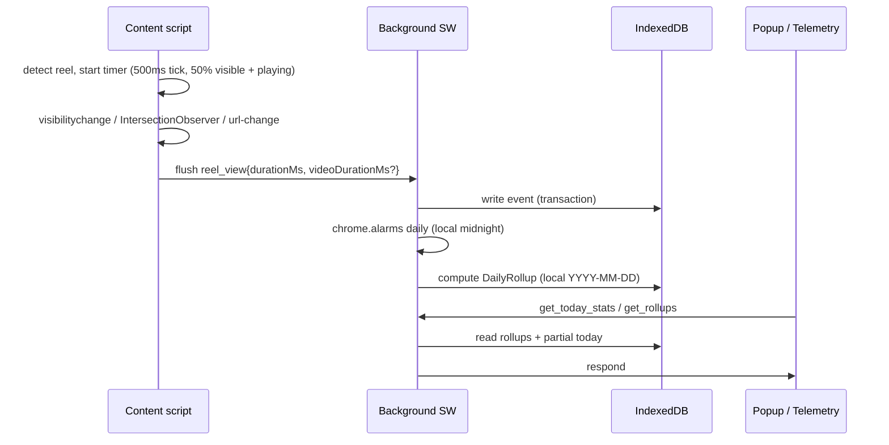
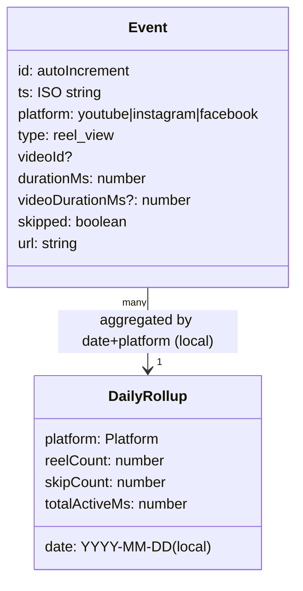

# Architecture

Intervention insight adapters consume scoped session contributions alongside unfiltered parent sessions and explicit preview coverage intervals. Return denominators require full threshold follow-up; filters apply to origins, preserving subsequent return evidence. Recurrence shares use completed-day totals. A controlled TelemetryFilters component relocates range/date/daypart selection into the analysis context without changing application state ownership.

Surface B page rebuild: a dedicated deterministic preview observation source feeds shared period, rollup, session, recurrence and viewing-distribution adapters. Session extraction precedes platform/daypart filtering. Dates and comparison cutoffs are local-calendar based; all visible metrics and exports use the same selected observations. Optional mechanics fields belong only to the preview contract. Popup and production storage/message contracts are unchanged.

Popup activity preview addition: deterministic timestamped `PopupMockView` observations feed pure popup aggregation and session grouping. Sessions join across platforms at gaps ≤60 seconds, retaining the latest end for overlaps. Today totals, platform metrics, hourly detail counts and measured early exits share that source. Yesterday uses the same cutoff. This local preview adapter adds no service-worker API and does not alter Surface B. Popup font loading is local/system-only.

Popup mock refinement (September 2026): `src/data/popupMock.ts` supplies one internally consistent platform dataset, derived headline/hourly values and same-cutoff yesterday fixtures. This is UI-only; production message/storage architecture and Surface B fixtures are unchanged. Popup readability overrides are scoped to its container.

Few words. Diagrams first.

## System shape

```mermaid
flowchart LR
  YT[YouTube content script] --> BG[Background SW]
  IG[Instagram content script] --> BG
  FB[Facebook content script] --> BG
  BG --> DB[(IndexedDB<br/>events + rollups<br/>doomgauge-v1)]
  BG -->|chrome.alarms daily<br/>local midnight| ROLL[Aggregate rollups]
  BG -->|get_today_stats / get_rollups<br/>Option A: sole reader| DASH[Popup (glance)]
  BG -->|get_rollups| FULL[Full telemetry page (new-tab)]
  DASH -->|chrome.tabs.create| FULL
  BG -->|export rollups + live today| JSON[(Minified JSON)]
```

## Event lifecycle



## Storage model

> Canonical types: `.spec/doom-gauge-v1/design.md#data-types` and `.spec/doom-gauge-v1/spec.md` (Requirements 4–5).



## Key rules
- One shared IndexedDB (`doomgauge-v1`) per browser profile — safe across 3–4 windows. **Option A:** only Background SW reads/writes IndexedDB; Popup/Telemetry request via `chrome.runtime.sendMessage`. No direct `DASH->DB` reads.
- IndexedDB only. No `chrome.storage`, no `localStorage`, no cookies.
- No backend in v1. Backend is a future, opt-in concern.
- Export = rollups + live partial rollup for today (minified). Raw event-log export is out of scope for v1.
- **Rollup rule:** `totalActiveMs = sum(durationMs)` for **all** events (skips included); `skipCount` where `durationMs < 3000` tracked separately. Date key is **local** `YYYY-MM-DD`; alarm fires at **local midnight**. `videoDurationMs` enables scary `watchPct = durationMs / videoDurationMs` and early-exit stats without affecting rollup.

## Popup viewing-distribution adapter

The popup derives duration buckets and median from its existing cutoff-filtered observations via `summarizeViewingDistribution`. The session summary separately derives reel and active-time concentration for the same selected session. These are local presentation adapters; event storage, rollups, background messaging and Surface B are unchanged.
# Telemetry filter follow-up

TelemetryFilters is a standalone header control group receiving date/comparison labels and a canonical ordered Daypart array. App owns the separate metric strip and analysis navigation. The observation selector combines checked periods with OR, treating an empty array as no observations; parent session grouping and unfiltered return targets are preserved. InterventionInsights renders a compact responsive overview, with local expansion for additional recurring windows and secondary period charts collapsed.

`components/ui/Clock.tsx` owns its system-time state, one-second timer and visibility refresh; unmount removes both timer and listener. Clock ticks do not update App or rerun observation calculations.

## Telemetry workspace architecture

`AnalysisWorkspace` owns contextual evidence history using a pure reducer. The context includes platform, period, date, dayparts and view; changing context remounts the workspace and clears evidence. `WorkspaceCanvas` emits typed selections without navigation. `EvidenceDrawer` renders the selected evidence in one native dialog: nonmodal alongside the canvas at host widths >=1076px (640px canvas +16px gap +420px drawer), otherwise a modal sheet. Native modal focus containment, Escape/Close and opener focus restoration are implemented. Existing observation/session/coverage adapters remain authoritative; bucket filters reconcile to popup duration boundaries. Old telemetry view components are no longer routed except the duration curve used inside evidence.

Evidence now always uses a modal overlay, replacing the responsive split layout. `evidenceTimeline` splits parent spans by local calendar day, clips window geometry without changing identity and keeps active time attributed to event start dates. `detailReducer` manages local session highlight and raw-record Back independently of main navigation. Existing context invalidation closes the overlay on scope/view changes.

AnalysisWorkspace now owns the top card row, visible view navigation, canvas and evidence selection. It calculates return rates once and passes the same result to TelemetryOverview and EvidenceDrawer. Shared OverviewCard APIs are unchanged; card size overrides are telemetry-scoped. Context keys continue to invalidate selection on view/filter changes.

Hint now portals fixed-position content to the nearest owning dialog or surface root. A pure positioning helper clamps/flips using viewport geometry; scroll/resize/ResizeObserver update the placement. Capture-phase Escape prevents modal cancellation before dismissing the hint, and outside-click/cleanup handlers are removed on close. SESSION_BUCKETS and sessionDistribution group selected session active time; sessionBucket evidence filters the original scoped session views before recovering full parent context. ReturnsControl consumes the existing shared ReturnRate array; OverviewCard APIs remain compatible with teal added.

Hint's existing `text` prop accepts `HintContent` (plain string or `HintFacts`). HintBody renders semantic definition lists and one optional note; hintFacts builds dynamic rows and measurementHints centralizes static definitions. AnalysisPanel and comparison hints pass the same union through without changing measurement calculations or portal ownership.

ReelRecords is extracted from EvidenceDrawer and accepts an observation array. Local filter/sort state feeds memoized filterReelRecords; recordPage clamps pagination and slices the result before rendering. Filtering/sorting operates on the full provided session array, never only the visible page, and does not mutate observations. Filter, sort and page-size actions reset pagination and scroll; session identity remounts the table. This bounds DOM size, not storage or computation over the source array.

AnalysisWorkspace passes selected dates and observation coverage into EvidenceDrawer. Multi-day window/bucket evidence delegates to CalendarEvidence; calendarEvidence derives daily contributions and coverage against the displayed day/window, retaining original parent sessions. Its local reducer owns date/session/records state, and the existing evidence/context remount clears it when scope changes. EvidenceTimeline accepts an optional date restriction so only the chosen day's clipped spans render. Daily metrics use local start-date attribution; records continue to expose the full parent session.

ReelRecords pagination and page-size controls precede the bounded table viewport in DOM order. Page sizes are 10/25/50, defaulting to 10; existing filter resets and scroll-to-top behavior remain intact.

Telemetry App owns a separate analysis/settings destination alongside its existing platform and selection state. SettingsPage is isolated from analytics UI; switching destinations unmounts AnalysisWorkspace (closing evidence), while period/date/view/daypart selections remain in App. No storage changes.

SettingsPage owns ephemeral mock period/platform/threshold/toggle/preview state. Threshold validation gates preview; editing configuration dismisses stale previews. No storage, background service, tracking or blocking integration is introduced. Leaving Settings discards the mock edits.

The shared analysis-content rule owns full main-column width and left alignment; Workspace.css only adjusts its padding. SettingsPage fills that shared content region. Overlay and popup width rules remain independently scoped.

CalendarEvidence derives its week/month presentation from the provided date count (<=7 versus >7). Both presentations reuse the same daily evidence model, shared bar maximum, reducer and records flow; no measurement or interface changes. Week mode places the inspector below a full-width strip, while month mode preserves the adjacent inspector where space permits.

CalendarEvidence now renders weekday headers in both modes and leading/trailing monthly blank cells. The scroll wrapper preserves seven-column geometry on narrow screens. These are presentation-only changes; daily aggregation and selection state are unchanged.

StatePreviewProvider lives above each app and owns development overrides, mounted-region registration and deterministic data presets. StateRegion resolves whole-page precedence, regional overrides and actual states, renders geometry-specific Skeleton/EmptyState/ErrorState, and wraps normal child rendering in RegionErrorBoundary. Retry clears the affected override and any governing page override while preserving unrelated regional overrides. Actual asynchronous status/retry can be supplied later; no async service or artificial wait is introduced now. Normal mode respects actual empty conditions. ViewingView's ResizeObserver follows the mounted SVG node with effect cleanup so a chart restored from a state preview is measured again.

### Theme persistence boundary
`src/theme/palette.ts` defines root semantic colors consumed by CSS and SVG charts. Both entrypoints await `initializeTheme()` before mounting React; a 1.5-second message timeout falls back to System. `ThemeController` manages optimistic changes, ordered saves, save errors and committed notifications; Settings renders its shared state.

A minimal WXT background accepts `theme:get` / `theme:set` only from extension-page senders, serializes operations, and broadcasts `theme:changed` after transaction commit. Only that background calls the theme storage adapter. IndexedDB `doomgauge-v1` gains an out-of-line-key `preferences` store with key `theme`; the adapter opens the current version, then upgrades additively if needed, preserving existing stores. Connections close on version changes; blocked/error/aborted operations report failure. No new permissions, browser storage APIs or network calls. Analytics remains on the existing mock-data path.

