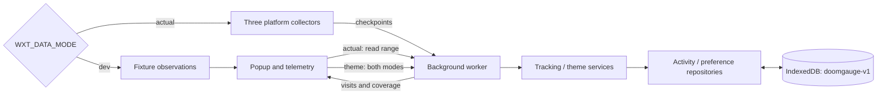
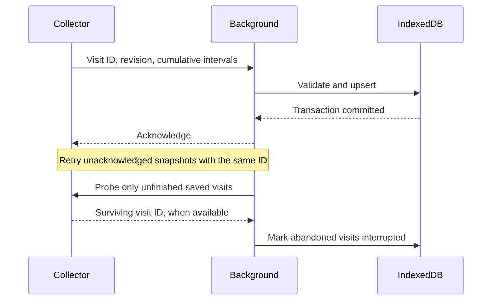

# Architecture

```mermaid
flowchart LR
  Mode{"WXT_DATA_MODE"} -->|dev| Fixtures["Fixture observations"]
  Fixtures --> UI["Popup and telemetry"]
  Mode -->|actual| Collectors["Three platform collectors"]
  Collectors -->|checkpoints| BG["Background worker"]
  UI -->|"actual: read range"| BG
  BG -->|"visits and coverage"| UI
  UI -->|"theme: both modes"| BG
  BG --> Services["Tracking / theme services"]
  Services --> Repositories["Activity / preference repositories"]
  Repositories <--> DB[("IndexedDB: doomgauge-v1")]
```

- Collectors: detect reels; measure focused playback.
- Background: sole database owner.
- One lazy database connection; typed messages; failure causes stay in local diagnostics.
- UI: calculate charts from observations.
- Reads: open/return, relevant saved changes, or reconnect; no UI polling.
- Startup: apply System, render immediately, then load saved theme; handlers precede maintenance.
- Dev: fixtures only; no tracking or activity writes.

## Save and recover

```mermaid
sequenceDiagram
  participant C as Collector
  participant B as Background
  participant D as IndexedDB
  C->>B: Visit ID, revision, cumulative intervals
  B->>D: Validate and upsert
  D-->>B: Transaction committed
  B-->>C: Acknowledge
  Note over C,B: Retry unacknowledged snapshots with the same ID
  B->>C: Probe only unfinished saved visits
  C-->>B: Surviving visit ID, when available
  B->>D: Mark abandoned visits interrupted
```

- Save: start, state changes, ~2s checkpoints.
- Recovery: keep saved time; exclude downtime.
- Summaries: one changed day per transaction; queries only read.
- Forced closure: unsaved tails can be lost.

[Contracts](../.spec/doom-gauge-v1/design.md) · [Acceptance criteria](../.spec/doom-gauge-v1/spec.md)
