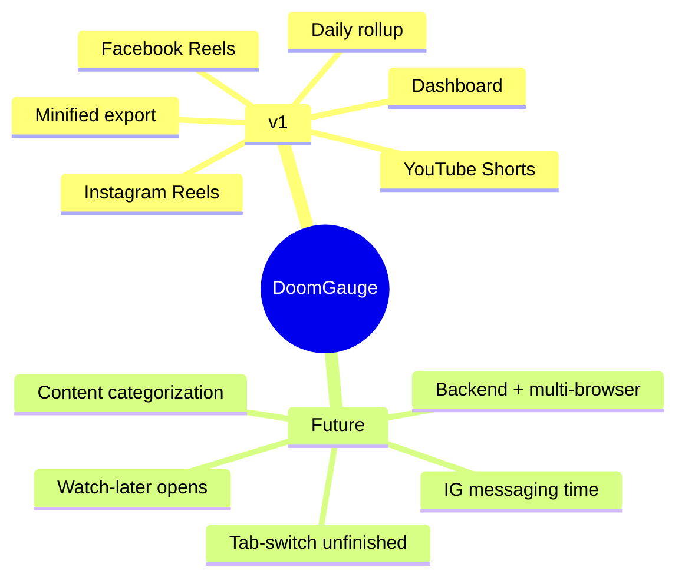
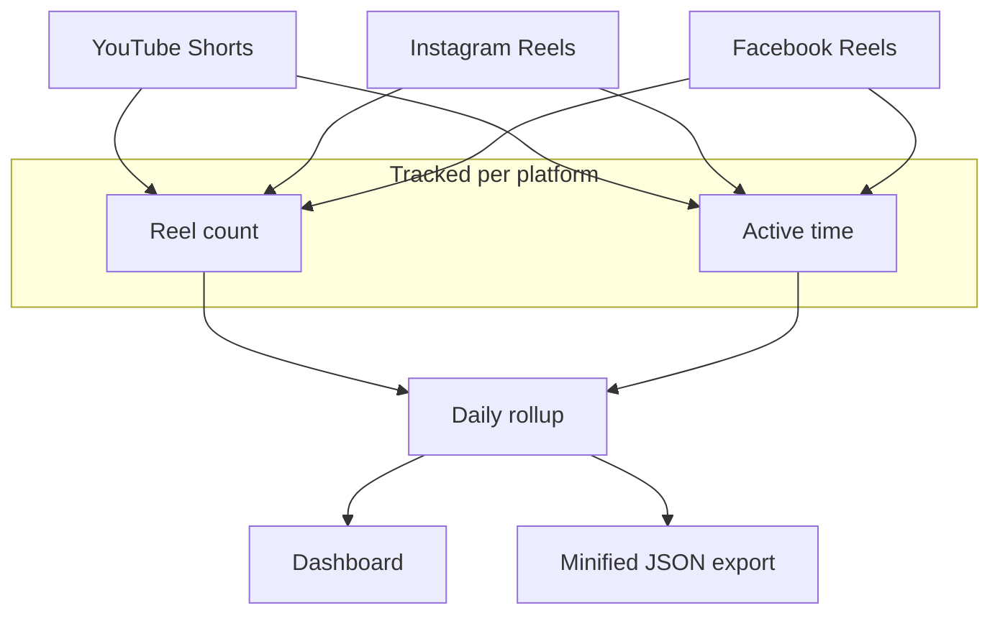
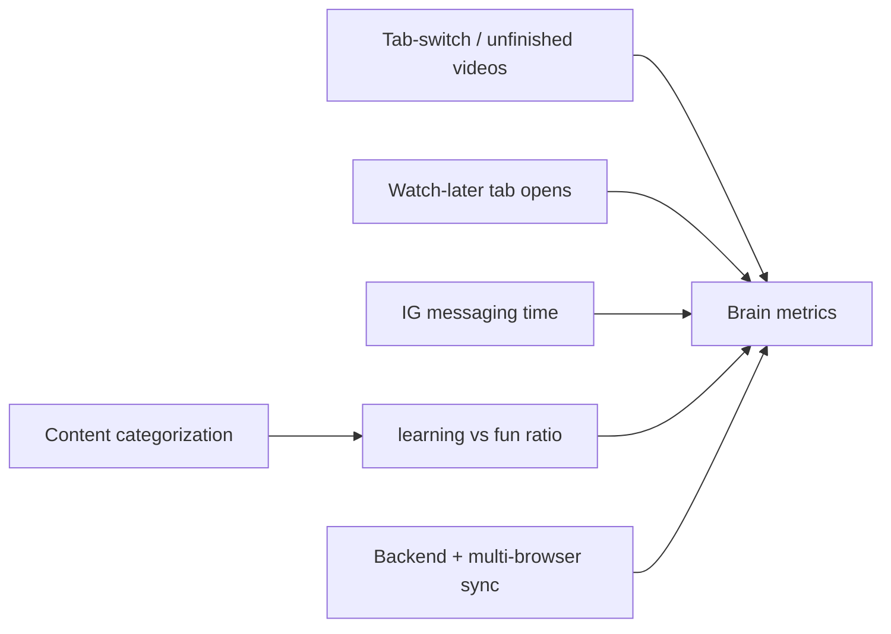

# Features

Scope is split into **v1** (what we build now) and **future** (roadmap).
Visual over prose — see the maps below.

> **Spec source of truth for v1 implementation:** `.spec/doom-gauge-v1/spec.md` (requirements + AC) and `.spec/doom-gauge-v1/design.md` (module/data design). This doc is the high-level vision map.

## v1 vs Future

## v1 — what ships

## Future — roadmap

## Where to implement

| Doc | Role |
|-----|------|
| `.spec/doom-gauge-v1/spec.md` | AC for each v1 feature (Requirements 1–9, P1–P7) |
| `.spec/doom-gauge-v1/design.md` | Data types, file tree, component design (Option A: BG sole DB reader, local dates, videoDurationMs) |
| `docs/ARCHITECTURE.md` | System-shape overview (diagrams) — details in `.spec/` |
| `docs/DESIGN.md` | Visual system (Neuro-Spike Telemetry) & design tokens |
| `docs/STACK.md` | Tooling + dependencies |
