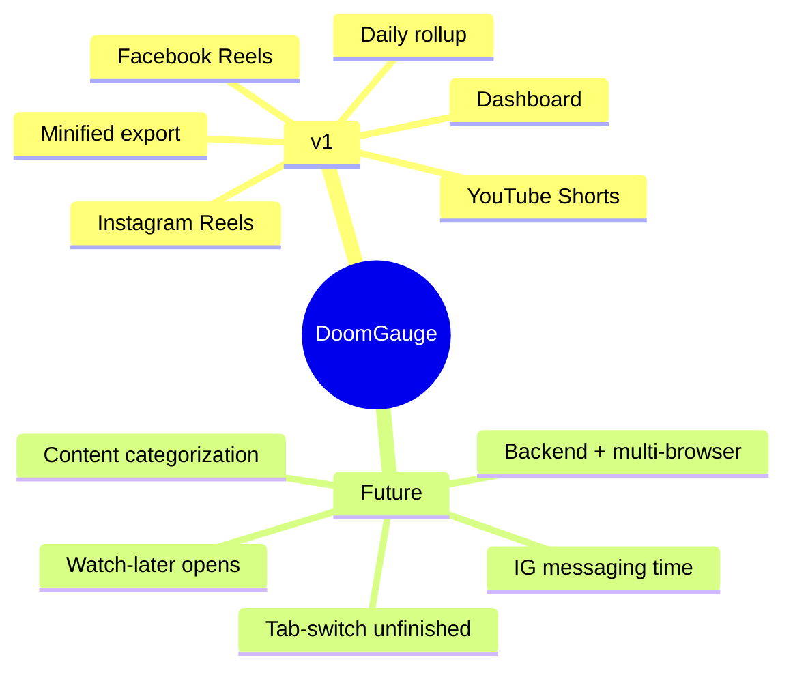
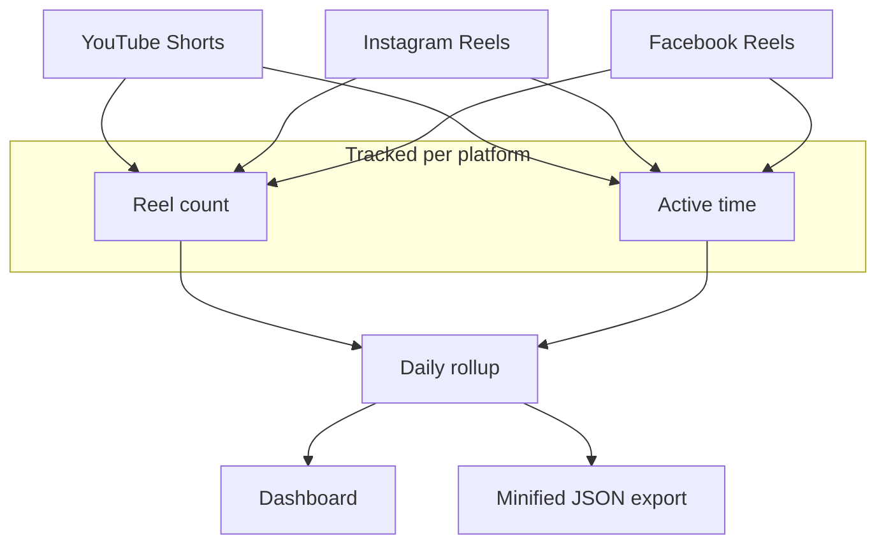
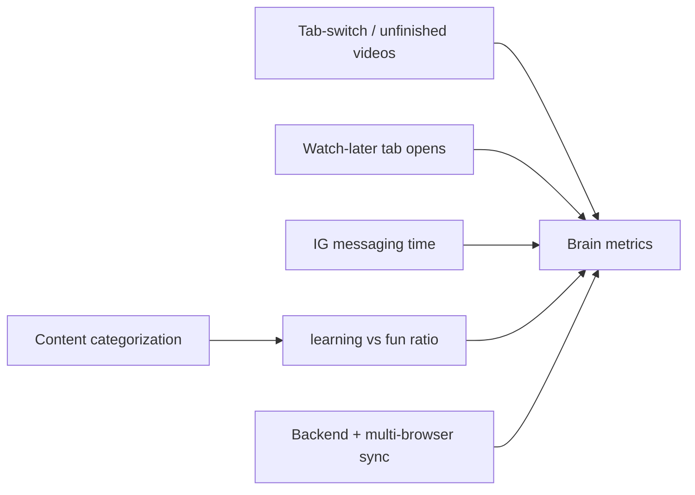

# Features

Telemetry intervention refinement: Patterns prioritizes session time concentration, coverage-qualified returns and ranked recurring windows. Detailed period charts remain expandable. Contextual reusable filters and stronger surface separation reduce navigation/visual effort. These insights remain descriptive mock observations; stop-loss settings and AI are later phases.

Surface B rebuild: Overview and dedicated platform pages share Patterns, Sessions and Viewing tabs. Recurring intervals replace the multi-day heatmap; session timelines and empirical watch-duration curves replace inferred clinical scores. Optional mechanics modules explicitly label simulated entry routes, replays and comment-open observations. See R7's approved mock-rebuild acceptance criteria.

Popup facts and polish refinement: Today combines its donut (with hover tooltips) and platform rows; Signals shows observed quick skips and average watch time with accessible <Hint> buttons; Hourly provides an hourly histogram with peak vulnerability hour. This is still popup-only mock work; recurring multi-day windows and real session tracking remain future work.

September 2026 popup refinement: active time and reel count lead; same-time yesterday comparisons, Quick skips filmstrips, average time per reel and hourly patterns provide secondary context. The approved R6 clarity revision replaces the older burn/Peak Channel/Velocity presentation while remaining mock-only.

Scope is split into **v1** (what we build now) and **future** (roadmap).
Visual over prose — see the maps below.

> **Spec source of truth for v1 implementation:** `.spec/doom-gauge-v1/spec.md` (requirements + AC) and `.spec/doom-gauge-v1/design.md` (module/data design). This doc is the high-level vision map.

## v1 vs Future

## v1 — what ships

## Future — roadmap

## Where to implement

| Doc | Role |
|-----|------|
| `.spec/doom-gauge-v1/spec.md` | AC for each v1 feature (Requirements 1–9, P1–P7) |
| `.spec/doom-gauge-v1/design.md` | Data types, file tree, component design (Option A: BG sole DB reader, local dates, videoDurationMs) |
| `docs/ARCHITECTURE.md` | System-shape overview (diagrams) — details in `.spec/` |
| `docs/DESIGN.md` | Visual system (Neuro-Spike Telemetry) & design tokens |
| `docs/PSYCHOLOGY.md` | User cognitive profile, dopamine slot-machine mechanics, urgency design rules |
| `docs/STACK.md` | Tooling + dependencies |

## Popup preview: viewing distribution

Signals now includes paired reel/time shares by active viewing duration and a median beside the average. Worst Vortex distinguishes its share of daily reels from daily active time. See the approved viewing-distribution criteria in `.spec/doom-gauge-v1/spec.md`; this remains derived mock telemetry, not production wiring.
# Telemetry refinement follow-up

Patterns uses a compact overview without inner tabs: session contributions, top-three recurring windows with inline expansion, and return rates. The shell uses a compact title/filter header, consolidated date context, a metric strip and unboxed analysis navigation. Time-of-day filtering supports multiple checked periods, All day reset and empty selections across summaries, comparisons, charts and exports.

Telemetry includes an independent HH:mm:ss local clock; observation dates and preview cutoffs retain their own meaning.

## Analysis workspace replacement

Telemetry now opens Time windows in one main canvas. A single View selector provides Trends, ranked Sessions and duration-bucket Viewing. A responsive evidence drawer replaces inspection-driven tab redirects; it supports contributing-session lists, sequence details, return evidence, platform breakdowns and measured-only mechanics. It retains a Back path and restores focus on close. This replaces the earlier Patterns/card iteration; preview data and popup remain unchanged.

Visual evidence refinement: the main workspace is capped at 1120px with a shared 36px headline summary. Evidence uses a wide modal overlay, date-grouped session timelines, paired return intervals and one highlighted session detail. Raw records have a Back action; explanations use icon hints.

Telemetry card/navigation refinement: reuse OverviewCard for Active time, Reels, Quick skips and Returns. Returns is directly inspectable above the chart in all views. A single visible Time windows / Trends / Sessions / Viewing button row replaces the dropdown; capped main content aligns left.

Clarity revision: OverviewCards use amber for increased usage and teal for decreased usage in popup and telemetry, while explicit urgency retains red. Returns is a separate control aligned with cards. Sessions shows six active-duration count buckets instead of a scrolling rank list; selecting a bucket opens visual evidence. Trends gains brighter lines and distinct solid/dashed legend samples. Shared hints float outside scrolling content and use concise multiline explanations.

Scannable-hint refinement: previous-period chart lines and markers are warm gold. Popup and telemetry icon hints now show labeled facts plus an optional short qualification, preserving dynamic dates, eligibility and measured coverage. See the call-site audit in DESIGN.md.

Reel records refinement: session evidence opens a paginated table with top-mounted pagination and 10/25/50 rows (10 by default), sortable start/active/elapsed columns, visible platform multi-select and quick-skip filters. Multi-day sessions also offer local start-date bounds. Only the current page is rendered; the existing session scope and Back action remain intact.

Multi-day calendar evidence: recurring-window and duration/session bucket inspection now shows a compact weekday calendar, one selected day's timeline and its session details. Cells encode selected active time on a shared scale; partial coverage and unobserved dates stay explicit. Latest matching date and largest contributing session open automatically. Session labels expose reel counts, and the records Back action restores the day/session. Single-day and return evidence retain their existing flow.

Settings foundation: a gear entry at the sidebar bottom opens a minimal Settings page. The sidebar preview notice is removed. Preferences, saved limits and enforcement remain future work.

Settings now includes an interactive stop-loss mock: daily/session period, combined platform selection, independent reel-count and active-minute limits, and an inline message preview. Defaults are illustrative; changes are local component state and are neither saved nor enforced. AI analysis and tab-switch tracking remain future items.

Telemetry and Settings now use the available page width beside the sidebar, including when collapsed, instead of leaving space beyond fixed content caps.

Evidence date presentation now adapts to range: up to seven dates use a chronological week strip with exact active time, reel counts and vertical bars; longer ranges retain the compact weekday calendar. Both show the date range, preserve coverage markers and inspect one selected day without extra navigation.

Evidence dates use a continuous calendar grid instead of separated cards. Weekday headers, complete monthly week rows and date-first typography make the date structure explicit; existing day/session selection remains unchanged.

UI states: popup, telemetry and Settings now share static skeletons, concise empty states and local errors with Retry. Development-only States controls preview the whole surface or one mounted region; data presets cover zero activity, filters, insufficient history and previous-only comparisons. Production builds omit preview controls; popup brand-click cycling is removed. Filters/navigation and evidence Back/Close remain available. Undefined platform shares display — rather than 0%.

### Shared appearance preference
Implemented System / Light / Dark in Settings, shared by popup and telemetry. Theme applies before app rendering, follows OS changes in System mode, and syncs committed changes to open surfaces. Saving failures retain the local choice and offer Retry. This preference is real; stop-loss controls remain an unsaved, unenforced mock. Both themes retain platform identities while neutral surfaces carry layout hierarchy. Acceptance criteria: active v1 spec, “Shared dark/light visual system”.

