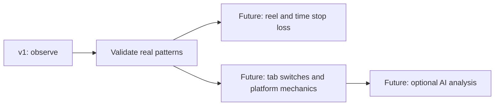

# Features

| Area | Implemented | Pending |
| --- | --- | --- |
| Collection | Three platforms; focused playback; viewing visits | Real-feed acceptance |
| Reliability | Checkpoints, deduplication, interrupted recovery | Forced-close acceptance; backup/restore |
| Popup | Today, Signals, Hourly; platform detail | Real-history visual acceptance |
| Telemetry | Platform pages; Time windows, Trends, Sessions, Viewing | Coverage/insight acceptance |
| Evidence | Calendar, selected-day timeline, paginated records | — |
| Settings | Saved System / Light / Dark | Stop-loss enforcement; editor is a mock |
| Development | Env-selected fixtures and state previews | — |
| Export | Selected-scope rollups as JSON | All-history export |

- No cloud, blocking or clinical scores in v1.

[Requirements](../.spec/doom-gauge-v1/spec.md) · [Remaining work](../.spec/doom-gauge-v1/tasks.md)
