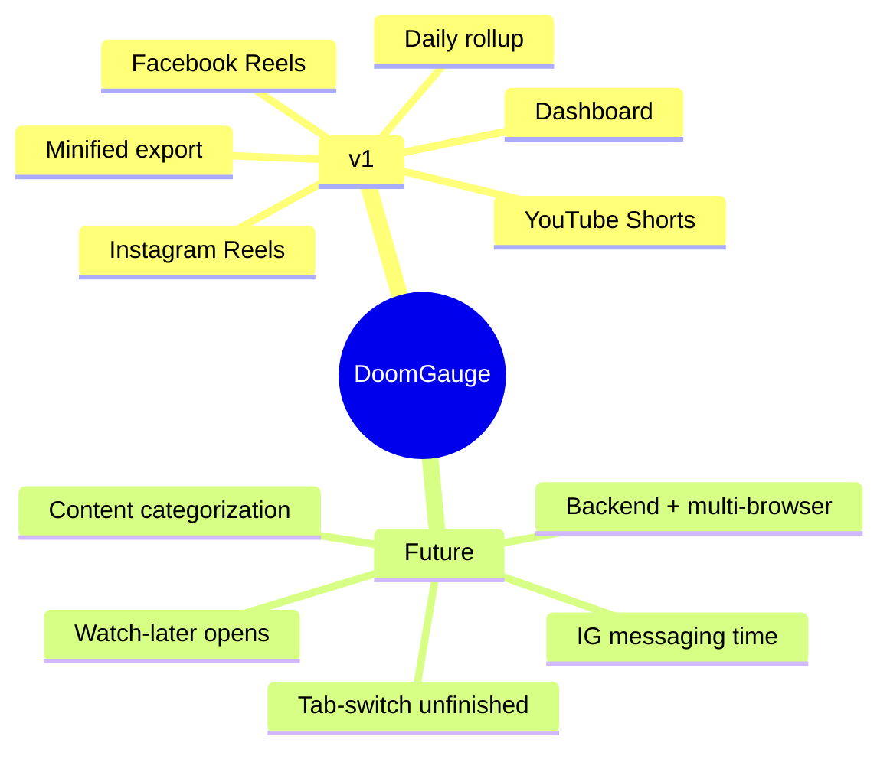
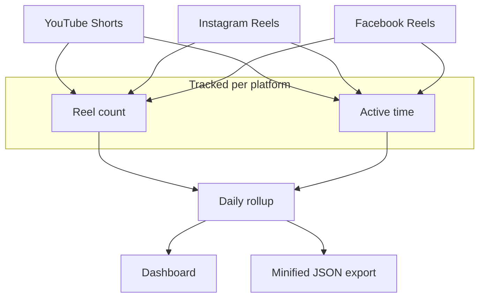
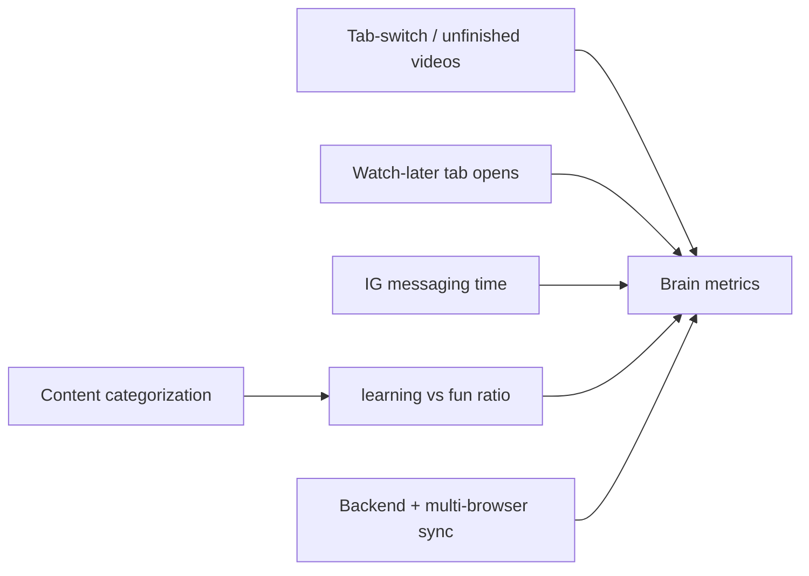

# Features

Scope is split into **v1** (what we build now) and **future** (roadmap).
Visual over prose — see the maps below.

## v1 vs Future

```mermaid
mindmap
  root((DoomGauge))
    v1
      YouTube Shorts
      Instagram Reels
      Facebook Reels
      Daily rollup
      Dashboard
      Minified export
    Future
      Tab-switch unfinished
      Watch-later opens
      IG messaging time
      Content categorization
      Backend + multi-browser
```

## v1 — what ships

```mermaid
flowchart TD
  subgraph track["Tracked per platform"]
    C[Reel count]
    T[Active time]
  end
  YT[YouTube Shorts] --> C
  YT --> T
  IG[Instagram Reels] --> C
  IG --> T
  FB[Facebook Reels] --> C
  FB --> T
  C --> R[Daily rollup]
  T --> R
  R --> D[Dashboard]
  R --> E[Minified JSON export]
```

## Future — roadmap

```mermaid
flowchart LR
  A[Tab-switch / unfinished videos]
  B[Watch-later tab opens]
  C[IG messaging time]
  D[Content categorization]
  E[Backend + multi-browser sync]
  D --> D1[learning vs fun ratio]
  A --> F[Brain metrics]
  B --> F
  C --> F
  D1 --> F
  E --> F
```
